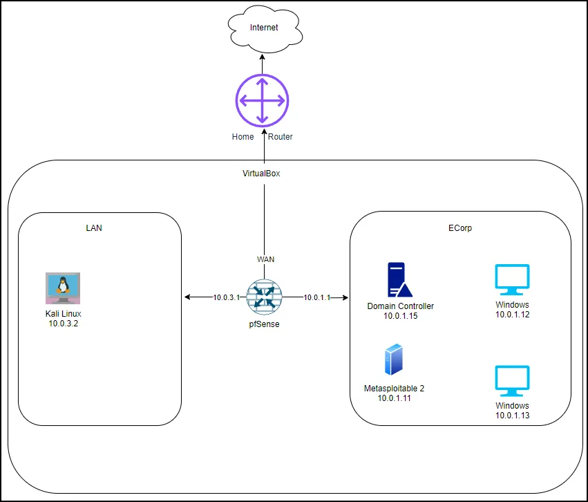
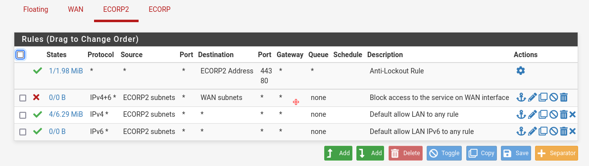
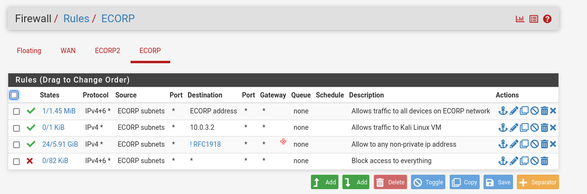
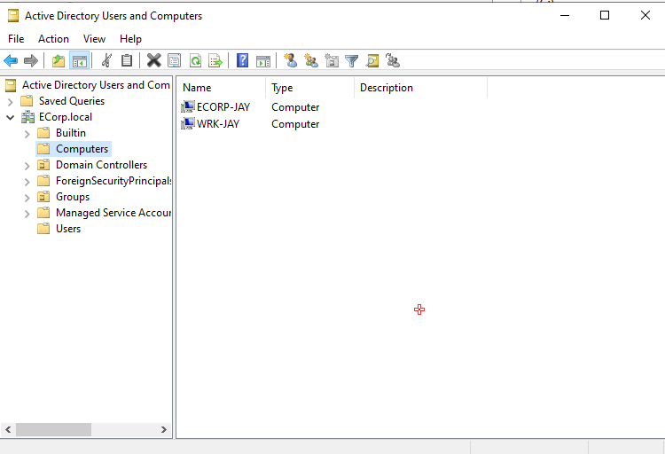
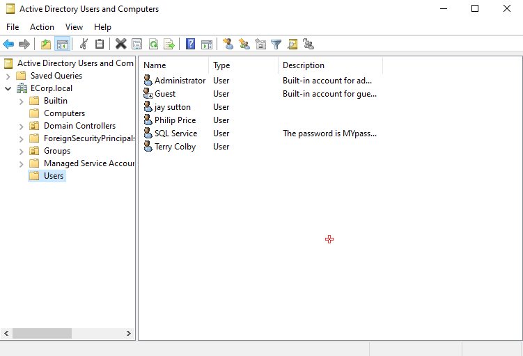
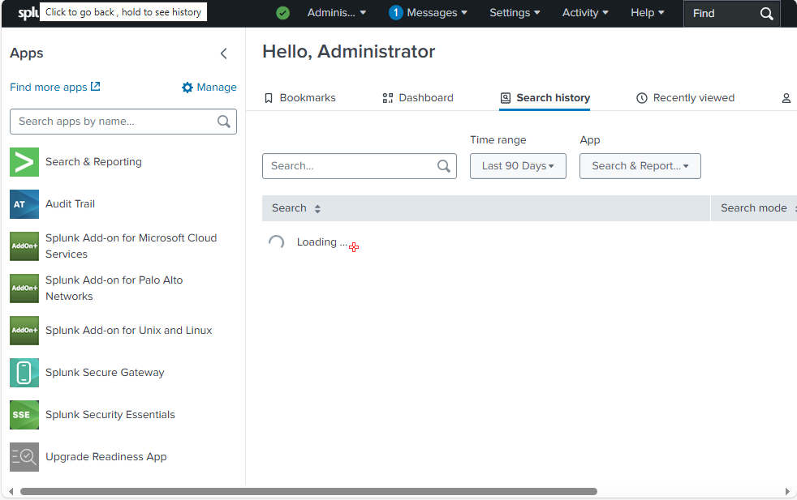

# 🧪 enterprise-cyber-homelab

This homelab simulates a small enterprise network using VirtualBox VMs. It includes attacker and victim machines, a firewall, Active Directory (on Windows Server 2022), and centralized logging with Splunk—designed for hands-on blue team and purple team practice.

---

## 🛠️ Lab Components

| VM Name           | Role                                    | Notes                                 |
|------------------|-----------------------------------------|----------------------------------------|
| **pfSense**       | Firewall/router                         | Interfaces LAN/WAN for segmentation    |
| **Kali Linux**    | Attacker machine                        | Used for recon, exploit, post-exploit |
| **metasploitable_2** | Vulnerable Linux target               | Used for red team testing              |
| **Win10-1**       | Domain-joined endpoint (client)         | Has Splunk UF, Sysmon, logging         |
| **Win10-2**       | Extra endpoint or victim (optional)     | Can be used for lateral movement       |
| **AD_ 2022**      | Domain Controller (Windows Server 2022) | Hosts `ecorp.local` domain             |
| **Nessus**        | Vulnerability scanner                   | Optional; not currently running        |

---

## 🧱 Network Architecture

- `10.0.3.0/24` — Attacker LAN (Kali Linux)
- `10.0.1.0/24` — Internal LAN (Windows, Metasploitable, AD)
- pfSense bridges traffic between networks with firewall rules

---

## 🔱 pfSense Firewall Rules

### 🔷 ECORP2 (Kali network)

- Allows full outbound access from Kali
- Blocks access to WAN
- Includes anti-lockout rule for pfSense access

---

### 🔷 ECORP (Windows network)

- Allows communication within ECORP subnet
- Explicit allow to Kali (10.0.3.2) for attack simulations
- Allows outbound access to non-private IPs
- Default deny rule at the bottom

## 🔐 Active Directory Setup

- Domain: `ecorp.local`
- Domain Controller: Windows Server 2022 (`AD_ 2022`)
- Domain-joined client: `Win10-1`
- Custom domain users:
  - One on `Win10-1`
  - One on `Win10-2`
 
---

## 🖥️ Active Directory Overview (Screenshots)

### 🧩 Domain-Joined Computers

- `ECORP-JAY` and `WRK-JAY` are joined to the `ecorp.local` domain
- These represent your Win10 lab endpoints

---

### 👤 Domain Users

- Custom users created in AD:
  - `jay sutton`
  - `Philip Price`
  - `SQL Service`
  - `Terry Colby`
- Descriptions and passwords configured for lab testing

These users and machines will be used for logon activity, privilege simulations, and domain-based attack scenarios in future exercises.

---

## 🔍 Logging & Detection

- **Sysmon**: Logs process creation, network connections, etc.
- **Splunk UF**: Installed on `Win10-1`
- **Splunk Web**: Accessed locally for event log analysis

- ---

### 📷 Splunk Interface

- Splunk is configured with several add-ons:
  - Microsoft Cloud Services
  - Palo Alto Networks
  - Unix and Linux
- Logs searchable through the "Search & Reporting" app
- Future plans include building detection dashboards and log correlation

---

Collected logs:
- Sysmon logs
- PowerShell activity
- Windows Security log (logon events, failures, etc.)

---

## 🎯 Simulated Attacks

- Recon: `nmap`, `netdiscover`, enum scripts
- Exploits: Metasploit against `metasploitable_2`
- PowerShell attacks: encoded payloads, `Invoke-Mimikatz`
- Credential access: Mimikatz, Pass-the-Hash
- Lateral movement: SMB, RDP, PsExec between Windows VMs

---

